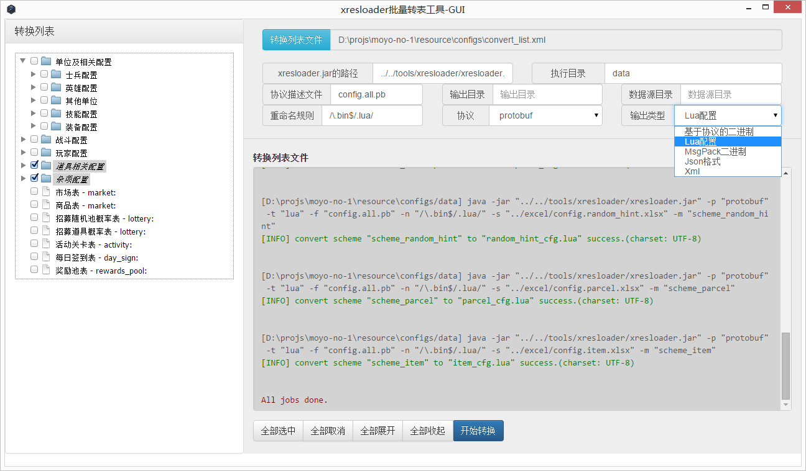
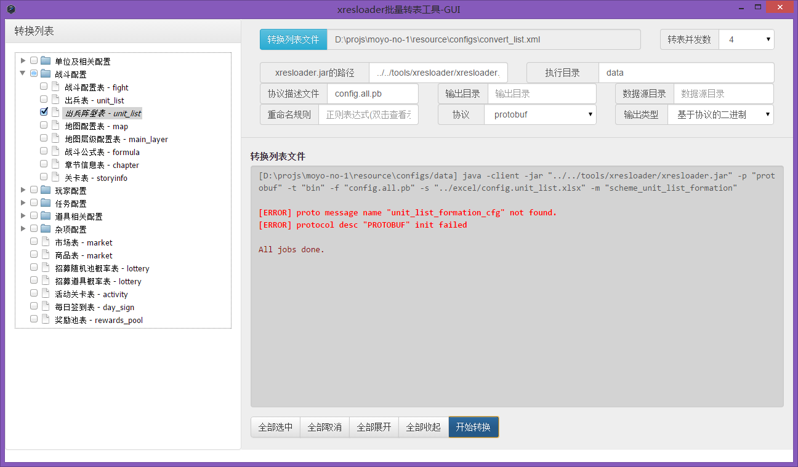

xresconv-gui
==========

这是一个符合 [xresconv-conf](https://github.com/xresloader/xresconv-conf) 规范的GUI转表工具，并且使用 [xresloader](https://github.com/xresloader/xresloader) 作为数据导出工具后端。

本项目基于 [Electron](http://electron.atom.io/) 项目，所以支持[Electron](http://electron.atom.io/)支持得所有平台（Linux、macOS和Windows）

Gitter on [xresloader](https://github.com/xresloader/xresloader)
------
[](https://gitter.im/xresloader/xresloader?utm_source=badge&utm_medium=badge&utm_campaign=pr-badge)

下载和使用
======
点击[此处](https://github.com/xresloader/xresconv-gui/releases)并根据需要下载对应系统的包，直接执行里面的二进制即可。

示例截图
------






注意事项
======
1. 文件名最好全英文，因为GUI工具中的编码统一使用UTF-8，而Windows默认编码是GBK。如果转表工具也使用UTF-8的话Windows下会找不到中文文件名。

开发使用说明
======
以下内容仅是对这个工具的开发和维护进行说明，直接使用的话[下载预发布包](https://github.com/xresloader/xresconv-gui/releases)即可

环境准备
======
1. 请自行安装node.js和npm（详见：https://nodejs.org）
> 基本组件安装: *npm install*
> 
> 开发环境安装: *npm install --save-dev gulp*  

直接启动
------
```
npm run-script start
```

调试模式启动
------

先修改[src/setup.js](src/setup.js),把里面的***debug***选项改为true，然后执行

```
npm run-script start
```

VSCode调试启动
------

先使用设定调试端口并启动

```
npm run-script debug
```

然后VSCode打开调试面板Attach到进程上


*VSCode里直接Launch的方式仅在Windows下有效*

**注：VSCode连接成功后，会立刻断点在程序启动处，这时候可以对需要断点的地方打断点，然后直接继续即可。**

打包和发布
======
+ 打包发布所有x64架构
> *npm run-script package*

+ 打包发布所有平台
> *npm run-script package-all*

关于加载和调试
======
本软件中大部分的外部库加载都没有问题，但是由于默认走的是node.js的沙箱机制，所以html内的script标签里某些库不会写出到全局。这时候需要手动加一下，比如：
```javascript
window.jQuery = require(`${__dirname}/lib/jquery/jquery.min.js`);
```

另外，调试模式运行只能调试[Electron](http://electron.atom.io/)进入的代码。
无法调试[Electron](http://electron.atom.io/)中[BrowserWindow](http://electron.atom.io/docs/api/browser-window/)的沙箱里的代码。
所以如果要调试[BrowserWindow](http://electron.atom.io/docs/api/browser-window/)内的代码还是要在[src/setup.js](src/setup.js)中把***debug***选项改为true。

关于NPM下载加速
======
1. 关闭npm的https
> *npm config set strict-ssl false* 

2. 设置npm的软件源
> *npm config set registry "http://registry.npmjs.org/"*
> 
> *npm config set registry https://registry.npm.taobao.org/*
> 
> *npm install -g cnpm --registry=https://registry.npm.taobao.org*

3. 代理
> + 设置代理： *npm config set proxy=http://代理服务器ip:代理服务器端口*
> + 取消代理： *npm config delete http-proxy*
> + 取消代理： *npm config delete https-proxy*
> + 单独设置代理： *npm install --save-dev electron-prebuilt --proxy http://代理服务器ip:代理服务器端口*